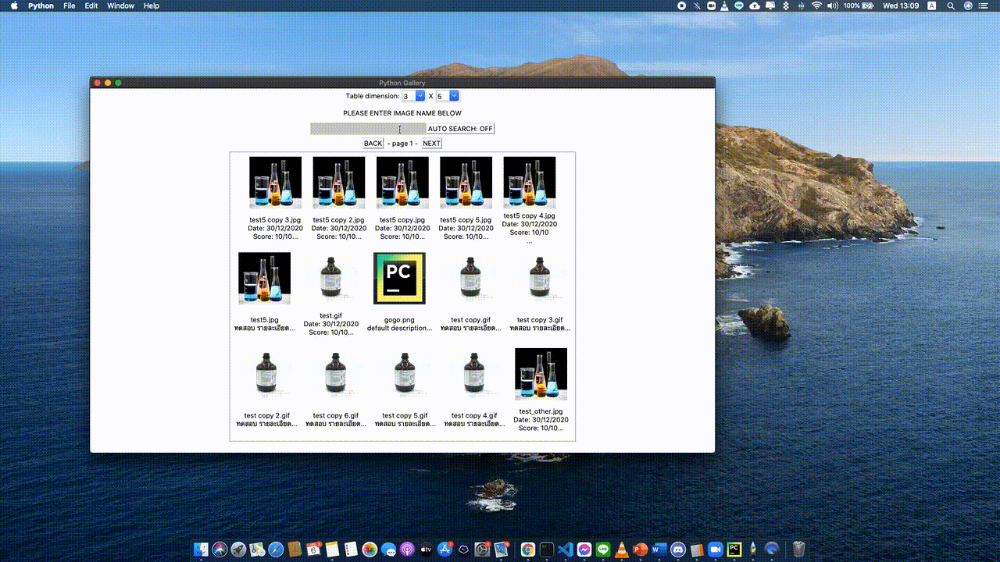
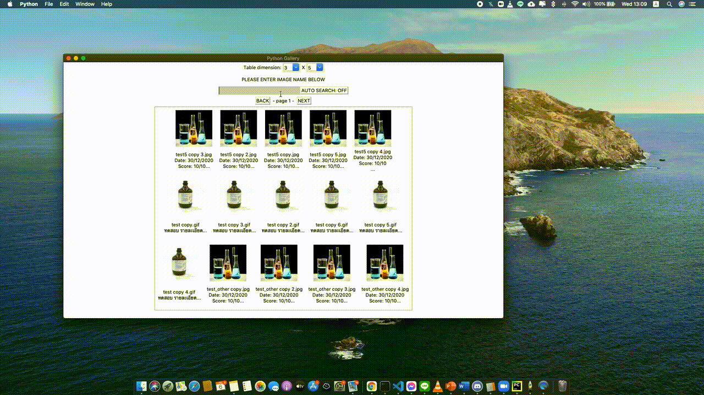

# Python Gallery

## Get Start
1. Go to program folder.  
`cd <program_path>`

2. install virtualenv  
`pip install virtualenv`

3. Create the virtual environment  
`virtualenv myenv`

4. activate virtualenv for Windowed   
`Set-ExecutionPolicy Unrestricted -Scope Process`  
`.\myenv\Scripts\activate`

5. activate virtualenv for MacOS  
`source myenv/bin/activate`

6. install requirment  
`pip install -r requirements.txt`

## How to create exe file for Window OS

1. call pyinstaller command  
`pyinstaller -Fw --clean main.py`

2. copy Folder `./img` and `./icon.co` file to `./dist` folder

3. run program on `./dist/main.exe`

## Notes
- to save requirment  
`pip freeze > requirements.txt`

- Deactivate the virtual environment  
`deactivate`

## Search Image - Press Enter Key

## Search Image - Realtime

## Page pagination

## Edit image data - Embeded to image file

